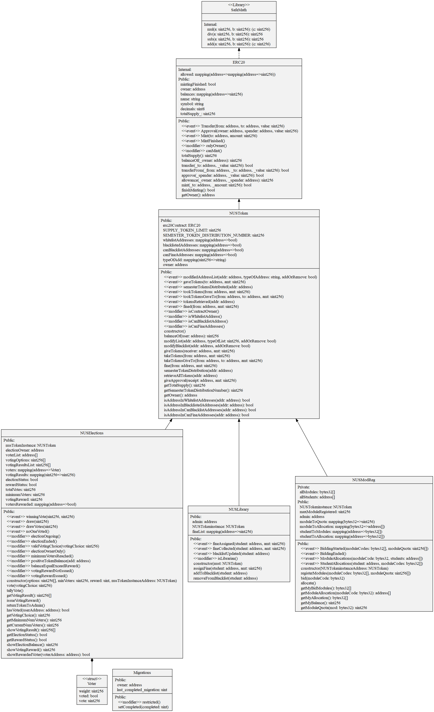

<div id="top"></div>

<br />
<div align="center">
    


<h3 align="center">NUS Token (NUST)</h3>

  <p align="center">
    Leveraging on blockchain technology to support key college proceess in NUS
  </p>
</div>

Table of Contents
  <ol>
    <li>
      <a href="#about-the-project">About The Project</a>
    </li>
    <li>
      <a href="#uml-diagram">UML Diagram</a>
    </li>
    <li>
    <a href="#usage">Usage</a>
        <ul>
            <li><a href="#prerequisites">Prerequisites</a></li>
            <li><a href="#unit-testing">Unit Testing</a></li>
        </ul>
    </li>
  </ol>

## About The Project

NUS Token aims to support key college processes, such as student body elections and module registration, so that the university can arrive at fair, unbiased outcomes for all staff and students. The NUSToken serves as a points system where students can utilise these tokens to bid for modules (NUS ModReg), vote for candidates in elections (NUS Election), as well as be used in penalising students in the cases of misbehaviour such as late returning of library books (NUS Library).. With NUSToken, the university can ensure that all these processes are done fairly without any discrimination against any parties

This project consists of 4 smart contracts.
1. NUSToken.sol
2. NUSModReg.sol
3. NUSLibrary.sol
4. NUSElections.sol

<p align="right">(<a href="#top">back to top</a>)</p>

## UML Diagram 




<p align="right">(<a href="#top">back to top</a>)</p>


## Usage

### Prerequisites

1. Install [Node.js](https://nodejs.org/en/download/)
2. 
    ```sh
    npm install truffle -g
    ```
3. Install [Ganache](https://trufflesuite.com/ganache/)

### Unit Testing
1. Open the Ganache app. 

2.  Run following commands from root of repo
    ```sh
    truffle compile 
    truffle migrate 
    truffle test 
    ```

<p align="right">(<a href="#top">back to top</a>)</p>


